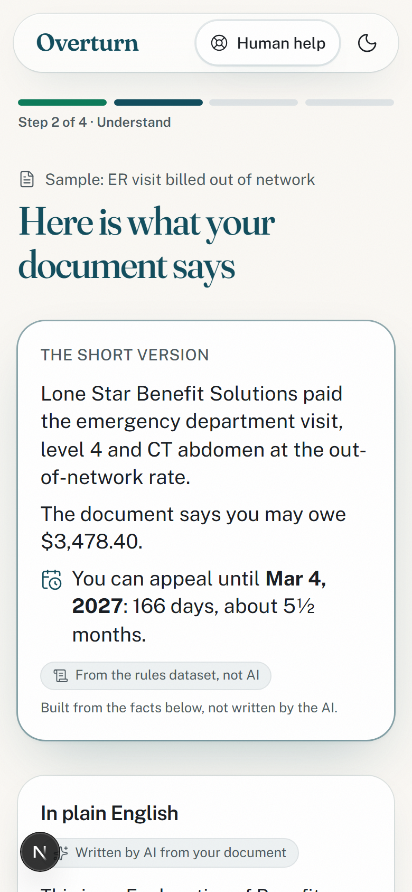
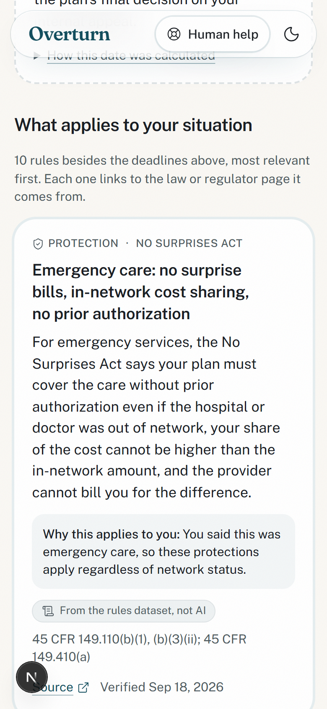
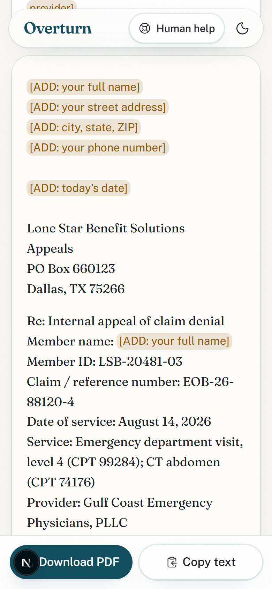

# Overturn

**Understand and contest a health insurance denial — in plain English, with the deadlines and
protections that apply, and a letter you can send.**

LexHack 2026 · Tracks: *Access to Justice & Civic Tech* (primary), *Legal Automation & Workflow Innovation*

> **Live demo:** https://overturn-peach.vercel.app · **Video:** _(link on the Devpost page)_
>
> Try it in under five minutes with a sample document; nothing is uploaded and nothing is stored.

---

## The problem

In 2024, insurers on HealthCare.gov denied **19 %** of in-network claims — about 85 million
denials. Consumers appealed **fewer than 1 %** of them. When they did appeal, insurers reversed
**34 %** of their own decisions.[^kff]

People do not skip the appeal because they agree with the denial. They skip it because the
letter is unreadable, the rights are unknown, and the deadline is invisible. The system works
for the people who can afford someone to read the letter for them.

[^kff]: KFF, *Claims Denials and Appeals in ACA Marketplace Plans in 2024*, https://www.kff.org/patient-consumer-protections/claims-denials-and-appeals-in-aca-marketplace-plans-in-2024/

## What Overturn does

A public home page, then four screens, one task each, on a phone.

| Step | What happens | Who does it |
|---|---|---|
| **1. Upload** | A denial letter or Explanation of Benefits (PDF or photo), or one of seven synthetic samples. | You |
| **2. Understand** | The facts, each with the exact words it came from; a plain-English summary at an 8th-grade reading level; your first deadline as a date and a countdown. | The model reads |
| **3. Rights** | Five questions, then the protections and deadlines that apply to *your* situation — federal baseline plus state rules for California, New York, and Texas — each with a primary source. | The code decides |
| **4. Letter** | An appeal letter drafted from your facts and those rights only, with visible blanks for everything Overturn does not know. Edit, download as PDF, or copy. | You send |

Every screen has a "Get free human help" button that lists the state Consumer Assistance
Program and regulator. Two more pages carry the context without crowding the flow:
**/learn** ("How appeals work": the four stages, what each state adds, FAQ, all rendered from
the same rules dataset) and **/about** (the problem, the information-vs-advice line, privacy,
scope).

<p align="center">
  
  
  
</p>

## The idea in one sentence

**The model reads, the code decides, the human sends.**

- A language model is very good at reading a messy two-page letter and pulling out who denied
  what, when, and why, with a quote for each fact. It is the wrong tool for deciding which law
  applies, because it cannot be audited and it will sound confident when it is wrong.
- So the rules live in a **versioned dataset** (`data/rules/`), each with a legal reference, a
  primary-source URL, and a last-verified date, and a **deterministic engine** applies them. A
  test fails the build if any rule lacks a source or is more than 45 days stale.
- The letter can only cite rules the engine produced: citations are emitted as markers and the
  server strips any it cannot back. Unknown facts become `[ADD: …]` blanks, never guesses.

## Legal design: information, not advice

Overturn explains what a document says and what rules generally apply. It never tells a
specific person what to do, never predicts the outcome, and never claims the denial was wrong.
This is enforced at three layers (prompt, product, copy), not stated in a footer. The full
argument, with the line we drew and how each layer holds it, is in
[LEGAL_DESIGN.md](LEGAL_DESIGN.md).

## What we deliberately did not build

| Not built | Why |
|---|---|
| Medicare, Medicaid, CHIP, TRICARE, VA | Different multi-level appeal systems with different deadlines. Overturn detects these documents and stops with the official link rather than applying the wrong rules. |
| The other 47 states | Each state's external-review law differs. Three states, three regulator models (CA dual DMHC/CDI with IMR, NY DFS external appeal, TX TDI IRO) prove the architecture; everyone else gets the federal baseline plus a link to their regulator, never a guess. Adding a state is [about half a day](data/rules/README.md). |
| Itemized bill audit (CPT codes, upcoding, duplicates) | Needs billing-code and price databases; a different product. The balance-billing check inferable from an EOB is included. |
| Sending the letter, accounts, case history | Would require storing protected health information. |
| Spanish | High impact, deferred; because rules are data and prose comes from the model, it is a cheap next step. |

## Quality, measured

- Lighthouse on the production landing page (2026-09-19): **accessibility 100**, SEO 100, best practices 96, performance 100 desktop / 91 mobile; the Learn page scores 100 / 100 / 96 / 92.
- Zero axe-core violations (WCAG 2.2 AA) on every screen, light and dark, phone and desktop; keyboard-only flow; verified in CI on each push and against the production deployment.
- 113 unit tests (rules engine golden table, dataset schema, guard, cached model outputs) and 5 end-to-end tests.

## Privacy

Documents are processed in memory during a single request and discarded. No database, no
upload storage, no analytics on content; only request timing and token counts are logged. Session
state lives in the browser tab. The API key is server-side only. The demo uses seven synthetic
documents (fictional insurers, people, and addresses, watermarked "SAMPLE").

Demo-grade limits are documented as such: a per-IP rate limit (3 uploads / 15 min) and an
`OVERTURN_LIVE_UPLOADS=false` switch that keeps the sample flow working if API credits run out.

## Supported scope (v1)

- **Documents:** denial letters (adverse benefit determinations) and Explanations of Benefits, PDF/JPG/PNG, ≤ 10 MB, ≤ 20 pages
- **Plans:** job-based (insured and self-funded), Marketplace, individual
- **Jurisdictions:** federal baseline everywhere; state overlays for CA, NY, TX
- **Denial categories:** medical necessity, prior authorization, out of network, not covered, coding/administrative, experimental, timely filing, duplicate, other
- **Protections:** internal appeal and external review rights and deadlines, expedited review, No Surprises Act (emergency care, out-of-network providers at in-network facilities), right to the claim file and clinical criteria

## Architecture

```
Browser (Next.js, React)                       Server (Next.js route handlers, Node)
┌──────────────────────────────┐               ┌──────────────────────────────────────┐
│ Upload / sample              │──multipart───▶│ POST /api/extract                     │
│                              │               │  Claude (PDF/image in, JSON out)      │
│ Understand                   │◀──facts+──────│  structured outputs → Zod (strict)    │
│  facts w/ quotes, deadline   │   summary     │  readability gate, advice-word scan   │
│                              │               │                                      │
│ Rights                       │  rules engine │ (same engine, re-run server-side)     │
│  5 answers → computeRights() │  in browser   │                                      │
│                              │               │ POST /api/draft                       │
│ Letter                       │──situation───▶│  Claude (facts + computed rights)     │
│  edit, PDF (react-pdf), copy │◀──draft───────│  guard: citations ⊆ rules, no advice  │
└──────────────────────────────┘               └──────────────────────────────────────┘
                     data/rules/*.json ── every rule: legal_ref, source_url, last_verified
```

## Stack and credits

| | |
|---|---|
| Framework | [Next.js](https://nextjs.org) 16 (App Router), React 19, TypeScript 5 — MIT/Apache-2.0 |
| UI | [Tailwind CSS](https://tailwindcss.com) 4, [shadcn/ui](https://ui.shadcn.com) on [Base UI](https://base-ui.com), [lucide](https://lucide.dev) icons — MIT/ISC |
| Fonts | [Public Sans](https://public-sans.digital.gov) (US Web Design System) and [Fraunces](https://github.com/undercasetype/Fraunces) (display serif) — OFL |
| Model | [Claude Opus 5](https://www.anthropic.com) via `@anthropic-ai/sdk`, structured outputs, PDF and image input — server-side only |
| Validation | [Zod](https://zod.dev) 4 — MIT |
| PDF | [@react-pdf/renderer](https://react-pdf.org) — MIT (letter export and the synthetic sample documents) |
| Dates | [date-fns](https://date-fns.org) 4 — MIT |
| Tests | [Vitest](https://vitest.dev) 5, [Playwright](https://playwright.dev) 1.6 with [axe-core](https://github.com/dequelabs/axe-core) — MIT/Apache-2.0/MPL-2.0 |
| Hosting | [Vercel](https://vercel.com) |
| Legal sources | eCFR via Cornell LII (29 CFR 2560.503-1; 45 CFR 147.136; 45 CFR Part 149), NY Senate (Ins. Law § 4904), NY DFS, California Legislative Information (HSC §§ 1368, 1374.30), Texas Public Law (Ins. Code § 4201.359), TDI, CMS, DOL EBSA — all listed per rule in `data/rules/` |
| AI tools used to build | [Claude Code](https://claude.com/claude-code) (Claude Opus 5) for specification, code, tests, and documentation, with [Spec Kit](https://github.com/github/spec-kit) for the spec → plan → tasks workflow. All legal content was read from primary sources and recorded with the date read. |

No pre-trained models were fine-tuned. No external datasets beyond the cited legal sources.
The seven sample documents were written for this project.

## Run locally

```bash
pnpm install
cp .env.example .env.local          # add ANTHROPIC_API_KEY
pnpm dev                            # http://localhost:3000
```

```bash
pnpm test                           # rules engine golden table, dataset schema, guard, cached sample outputs
pnpm test:e2e                       # Playwright: sample flow at 375 px, axe WCAG 2.2 AA, keyboard, PDF download
pnpm gen:samples                    # regenerate the synthetic sample PDFs
pnpm precompute [id …] [--letters]  # refresh cached model outputs (costs API credits)
```

Environment: `ANTHROPIC_API_KEY` (required for live uploads); optional `OVERTURN_MODEL`,
`OVERTURN_EXTRACT_EFFORT`, `OVERTURN_WRITE_EFFORT`, `OVERTURN_RATE_LIMIT`, `OVERTURN_LIVE_UPLOADS`.

## Project documents

- [specs/001-denial-appeal-assistant/](specs/001-denial-appeal-assistant/) — specification, plan, research (legal sources), data model, contracts, tasks
- [LEGAL_DESIGN.md](LEGAL_DESIGN.md) — the information-vs-advice argument
- [data/rules/README.md](data/rules/README.md) — the rules dataset and how to add a state
- [docs/api-spend.md](docs/api-spend.md) — every API call made while building, with cost

## License

MIT. The legal content in `data/rules/` summarizes public law and regulator guidance; it is
information, not advice, and it carries the date each source was read.
